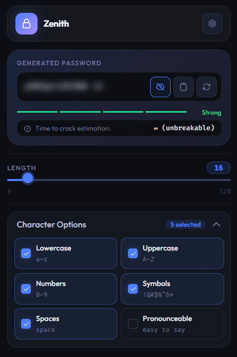

# 🌌 Zenith — Simple Browser Extension Password Generator  ~Beta version !


<p align="center">
  
</p>

<p align="center">
  <strong>Gelişmiş ve güvenli tarayıcı eklentisi şifre oluşturucu.</strong><br>
  <em>Advanced and secure browser extension password generator.</em>
</p>

<p align="center">
  
  
  
</p>

---

## 🚀 Öne Çıkan Özellikler (Features)

*   **🛡️ Kriptografik Güvenlik:** `crypto.getRandomValues` kullanarak tamamen rastgele ve tahmin edilemez şifreler üretir.
*   **🧩 Okunabilir Şifreler:** Karmaşık diziler yerine, akılda kalıcı ama güvenli "telaffuz edilebilir" şifre moduna sahiptir.
*   **⚡ Akıllı Pano Temizleme:** Şifreyi kopyaladıktan sonra yapıştırdığınızda (veya 5 dakika sonra) panonuz otomatik olarak temizlenir.
*   **💎 Premium Arayüz:** Modern cam morfolojisi (glassmorphism) efektleri, karanlık/aydınlık tema desteği ve akıcı animasyonlar.
*   **🌍 Çoklu Dil Desteği:** Türkçe ve İngilizce dilleri arasında bayrak ikonlu özel seçici ile anında geçiş yapın.
*   **🔍 Güvenlik Analizi:** Şifrenizin gücünü görsel olarak takip edin ve kırılma süresi tahminini anlık olarak görün.

---

## 🛠️ Teknik Altyapı (Tech Stack)

```text
  ┌───────────────────────────────────────────┐
  │  FRONTEND  : HTML5, CSS3 (Vanilla), JS    │
  │  API       : Chrome Extension Manifest V3 │
  │  SECURITY  : Web Crypto API, Offscreen Doc│
  │  THEME     : Light / Dark Auto-Detection  │
  └───────────────────────────────────────────┘
```

---

## 📥 Kurulum (Browser Extension Installation)

1.  Bu repoyu bilgisayarınıza indirin (ZIP olarak veya `git clone`).
2.  Tarayıcınızda (Chrome, Edge, Brave, Opera) `chrome://extensions` (veya `edge://extensions`) sayfasına gidin.
3.  Sağ üstteki **"Geliştirici Modu"** (Developer Mode) anahtarını açın.
4.  **"Paketlenmemiş öğe yükle"** (Load unpacked) butonuna tıklayın.
5.  İndirdiğiniz bu klasörü seçin ve Zenith tarayıcı eklentisini kullanmaya başlayın!

---

## 🛡️ Gizlilik ve Güvenlik (Privacy & Security)

Zenith, gizliliğinizi en üst düzeyde tutar:
*   ❌ **İnternet Bağlantısı Yok:** Hiçbir veri dışarıya gönderilmez.
*   ❌ **Takip Yok:** Kullanıcı verileri asla kaydedilmez.
*   ✅ **Açık Kaynak:** Tüm kodlar şeffaftır ve güvenlik denetimine açıktır.

---

## 📸 Ekran Görüntüleri (Screenshots)

<p align="center">
  
</p>

---
